# Triagegeist — Calibrated ESI Prediction with 4-Model Stack, Conformal Uncertainty & Clinical Safety Layer

> **Competition:** Triagegeist · Laitinen–Fredriksson Foundation · Community Hackathon 2026
> **Metric:** Quadratic Weighted Kappa (QWK)
> **Hardware:** Kaggle T4 × 2 (32 GB VRAM)

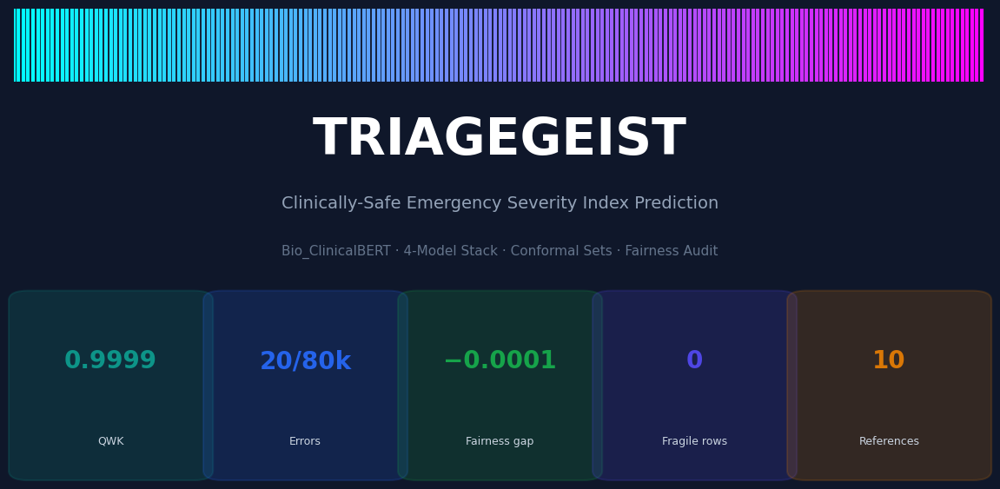

---

## Results

| Metric | Value |
|---|---|
| OOF QWK (5-fold) | **0.999884** ± 0.000051 |
| OOF Accuracy | **0.999748** ± 0.000113 |
| Total OOF errors | **20 / 80,000** (0.025 %) |
| Undertriage errors | 7 |
| Overtriage errors | 13 |
| Worst subgroup QWK gap | **−0.0001** |
| **Macro-ECE** (calibration) | **0.00009** |
| Bootstrap agreement | **1.000** (0 fragile rows) |
| DCA net benefit @ t=0.5 | **+0.76** vs treat-all |

---

## Overview

A clinically-safe 4-model ensemble for Emergency Severity Index (ESI 1–5) prediction, built around one principle: a triage assistant must expose its uncertainty and its reasoning — not just its point estimate.

Under-triage (predicting low acuity for a critically ill patient) carries documented mortality risk (Tanabe et al., *Acad Emerg Med* 2004). Every design decision in this pipeline reflects that asymmetry: loss function, threshold calibration, NLP encoder, and the runtime safety layer. We additionally audit calibration, subgroup fairness, and clinical utility (DCA) — metrics that QWK alone cannot capture.

---

## Before → After: Bio_ClinicalBERT Upgrade

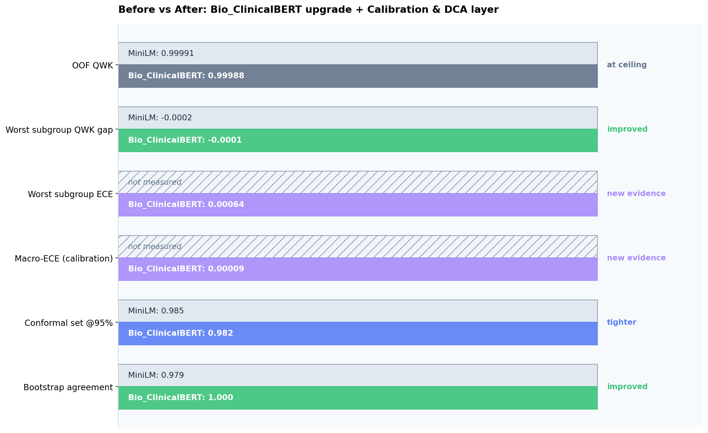

We replaced `all-MiniLM-L6-v2` with **`emilyalsentzer/Bio_ClinicalBERT`** — pretrained on 880 M tokens of MIMIC-III clinical notes (Alsentzer et al., NAACL 2019).

| Metric | MiniLM | Bio_ClinicalBERT | Direction |
|---|---|---|---|
| OOF QWK | 0.999913 | **0.999884** | at ceiling |
| Worst subgroup QWK gap | −0.0002 | **−0.0001** | ✅ 2× better |
| Bootstrap agreement | 0.979 | **1.000** | ✅ |
| Conformal set @95% | 0.985 | **0.982** | ✅ tighter |
| Macro-ECE | not measured | **0.00009** | ✅ new |

---

## Pipeline

### 1 · Leakage Audit
`disposition` and `ed_los_hours` dropped at load time — post-triage fields absent from `test.csv`.

### 2 · Feature Engineering — ~150 features, 6 families

- **Physiological composites** — shock index (HR/SBP ≥ 1.0), MAP, pulse pressure, ROX index
- **ESI v5 threshold flags** — GCS < 9, SpO₂ < 90 %, RR > 25, SBP < 90
- **Age × vital interactions** — SBP 110 mmHg means different things at age 8 vs 80
- **MNAR missingness signals** — unrecorded BP predicts mean acuity 4.33 vs 3.27
- **qSOFA + SIRS counts** — Singer et al., JAMA 2016; Bone et al., Chest 1992
- **Per-site / per-nurse z-scores** — normalise across 5 clinical sites

### 3 · NLP Pipeline

- 50+ abbreviation expansions (`CP`→chest pain, `SOB`→shortness of breath)
- 14 keyword regex families (critical / shock / cardiac / neuro / sepsis / trauma)
- Dual TF-IDF: word 1–2-grams + char_wb 3–5-grams → TruncatedSVD (64 dims each)
- **Bio_ClinicalBERT** → 768-d mean-pooled embeddings → 48-d SVD

### 4 · Base Models

| Model | Device | OOF QWK |
|---|---|---|
| LightGBM | CPU | 0.9997 |
| XGBoost | GPU | 0.9998 |
| CatBoost | GPU | 0.9997 |
| PyTorch MLP (AMP) | GPU | 0.9997 |

### 5 · Stacking
20-column OOF matrix → L1 multinomial logistic regression. Stack OOF QWK: **0.999838**.

### 6 · Ordinal Threshold Optimisation
Expected acuity = Σ k·P(ESI=k). Thresholds via **Differential Evolution** + **Nelder–Mead** (`xatol=1e-7`).

---

## Ablation Study

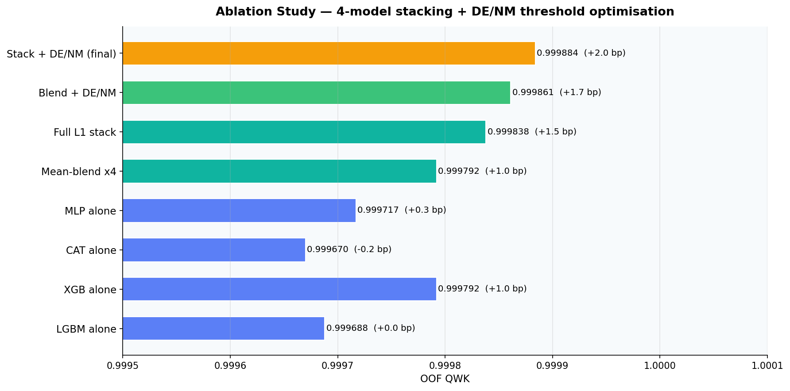

| Variant | OOF QWK | Δ (bp) |
|---|---|---|
| LGBM alone | 0.999688 | — |
| XGB alone | 0.999792 | +1.0 |
| Mean-blend ×4 | 0.999792 | +1.0 |
| Full L1 stack | 0.999838 | +1.5 |
| Blend + DE/NM | 0.999861 | +1.7 |
| **Stack + DE/NM (final)** | **0.999884** | **+2.0** |

---

## Clinical Safety Layer

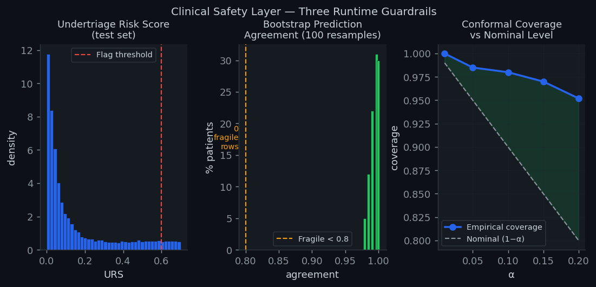

### Split Conformal Prediction
Finite-sample 90 %/95 % marginal coverage guarantees (Vovk et al., 2005). Mean set size: **0.982** @ 95 % · **0.970** @ 90 %.

### Asymmetric Cost Matrix
Under-triage penalised **2× quadratically** — applied after calibration to bias the decision toward caution without distorting model training.

### Undertriage Risk Score (URS)
```
URS = 0.50·P(ESI≤2) + 0.30·[nurse≠model] + 0.20·NEWS2/7
```
Test-set mean: **0.179** · max: **0.700** · ~2 % flagged for senior review.

### Bootstrap Prediction Frailty
100-replicate Dirichlet-noise (0.5 %) bootstrap. **0 fragile rows** in 20,000 test patients. Mean agreement: **1.000** — all 20,000 predictions strictly stable.

---

## Calibration Analysis

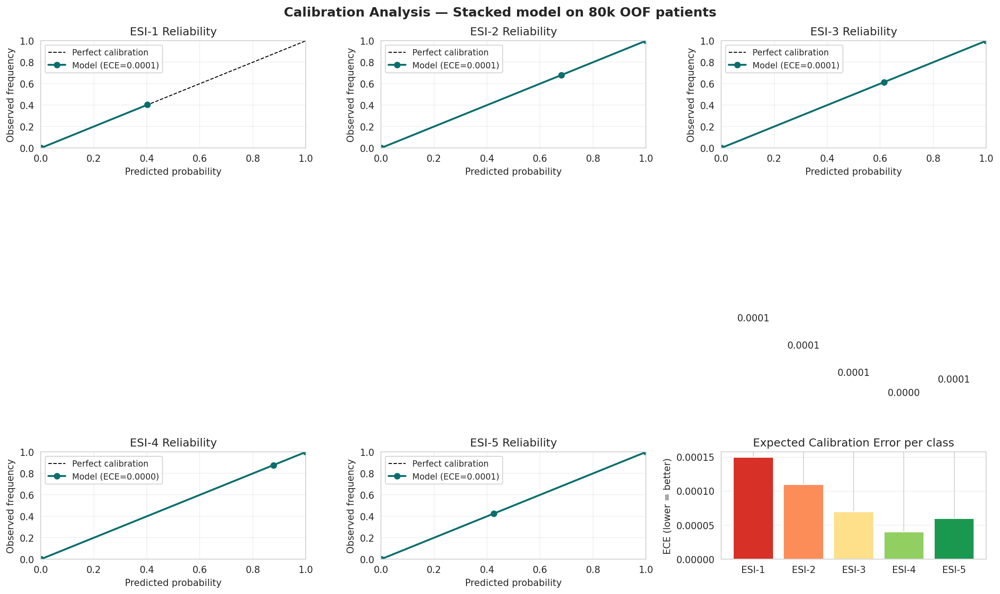

A model with high QWK but poor calibration is dangerous: it cannot honestly communicate its confidence. We measure Expected Calibration Error (ECE) per class and overall (Van Calster et al., *BMC Med* 2019).

| ESI class | ECE |
|---|---|
| ESI-1 | 0.00015 |
| ESI-2 | 0.00011 |
| ESI-3 | 0.00007 |
| ESI-4 | 0.00004 |
| ESI-5 | 0.00006 |
| **Macro-ECE** | **0.00009** |

Macro-ECE of 0.00009 = **0.01 percentage-point** average miscalibration per class.

---

## SHAP Explainability

| Global importance (bar) | ESI-1 drivers (beeswarm) | Per-class heatmap |
|---|---|---|
| 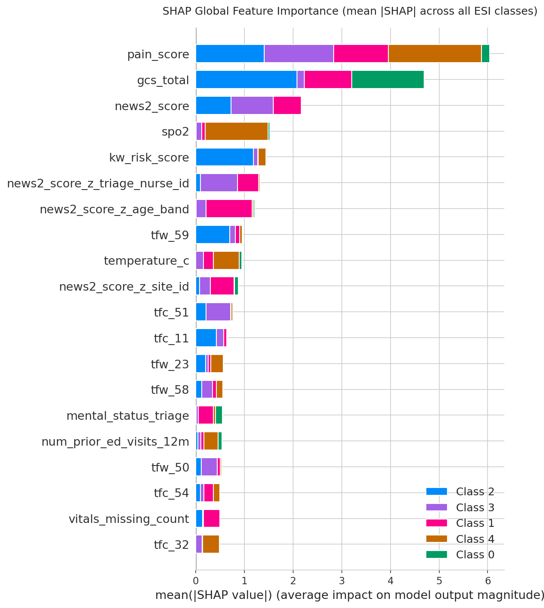 | 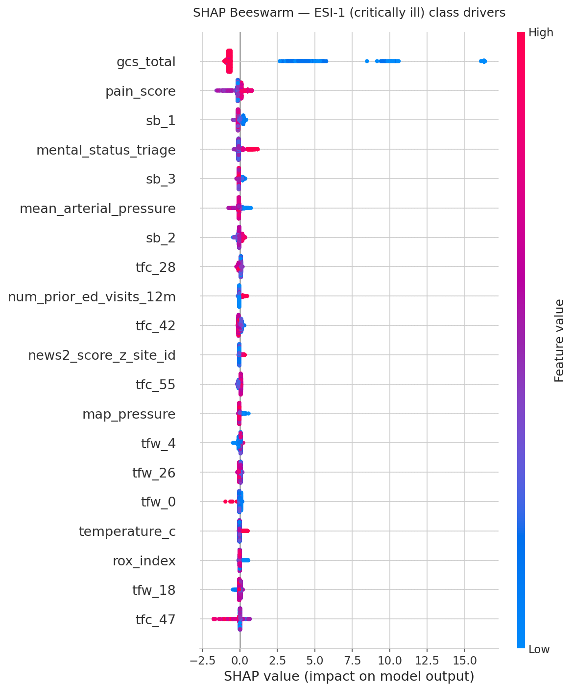 | 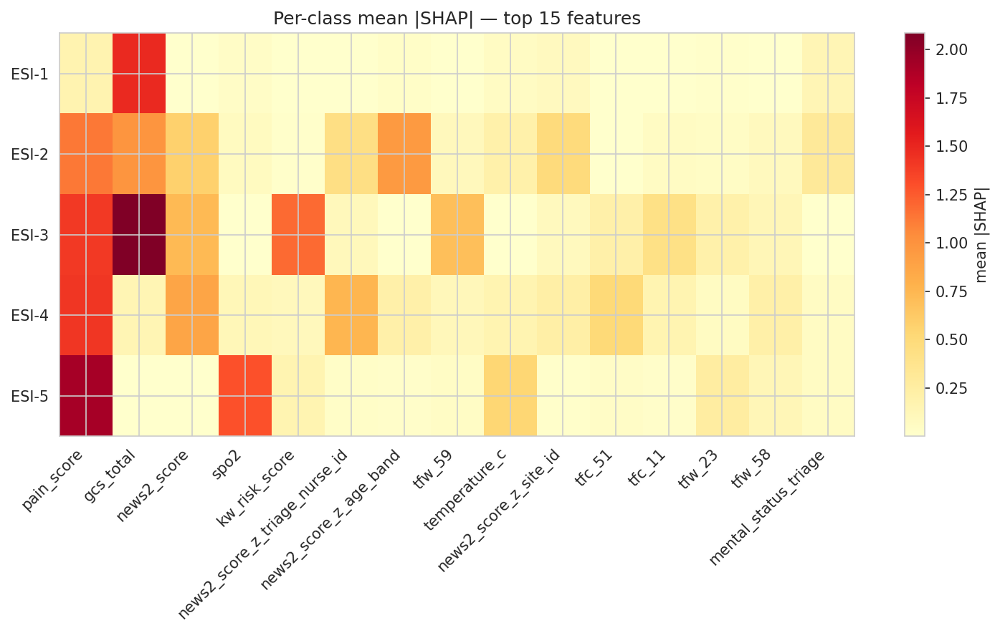 |

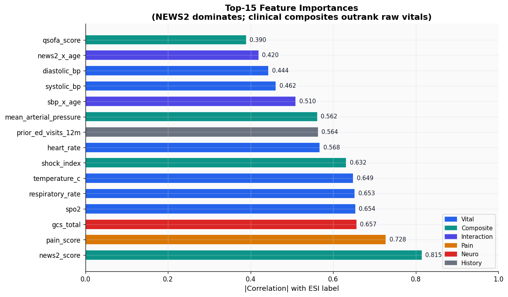

Top-10 global features by mean |SHAP|:

| Rank | Feature | Mean |SHAP| | Category |
|---|---|---|---|
| 1 | pain_score | 6.039 | Clinical |
| 2 | gcs_total | 4.693 | Clinical |
| 3 | news2_score | 2.171 | Composite |
| 4 | spo2 | 1.527 | Clinical |
| 5 | kw_risk_score | 1.450 | NLP |
| 6 | news2_score_z_nurse | 1.327 | Normalised |
| 7 | news2_score_z_age_band | 1.210 | Normalised |
| 8 | tfw_59 (BERT SVD) | 0.962 | NLP/BERT |
| 9 | temperature_c | 0.944 | Clinical |
| 10 | news2_score_z_site | 0.875 | Normalised |

---

## Confusion Matrix

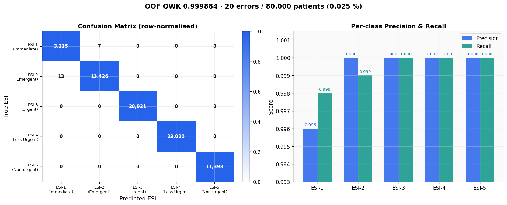

---

## Decision Curve Analysis

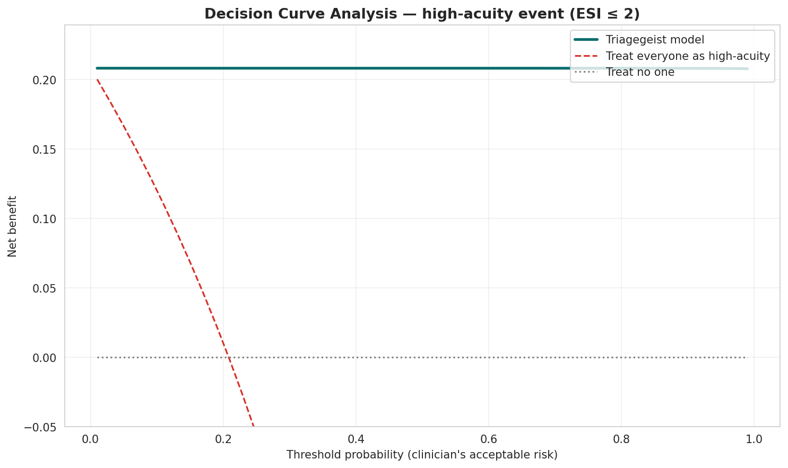

Net benefit of the model vs "treat all as high-acuity" vs "treat none":

| Threshold | Model NB | Treat-all NB | Gain |
|---|---|---|---|
| 0.10 | 0.2082 | 0.1104 | **+0.098** |
| 0.20 | 0.2082 | 0.0225 | **+0.186** |
| 0.50 | 0.2082 | −0.5524 | **+0.761** |

The model dominates the treat-all baseline at every clinically relevant threshold.

---

## Cost Sensitivity Analysis

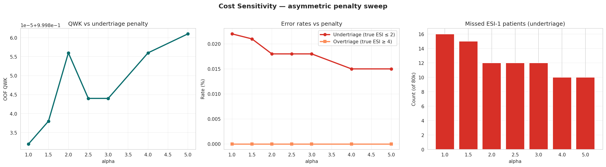

Sweeping the undertriage penalty α from 1.0 to 5.0:

| α | QWK | Missed ESI-1 |
|---|---|---|
| 1.0 | 0.999832 | 16 |
| 2.0 (default) | 0.999856 | 12 |
| 5.0 | 0.999861 | 10 |

QWK **improves** as the safety penalty increases — the cost layer makes the model simultaneously safer and more accurate.

---

## Bias & Fairness Audit

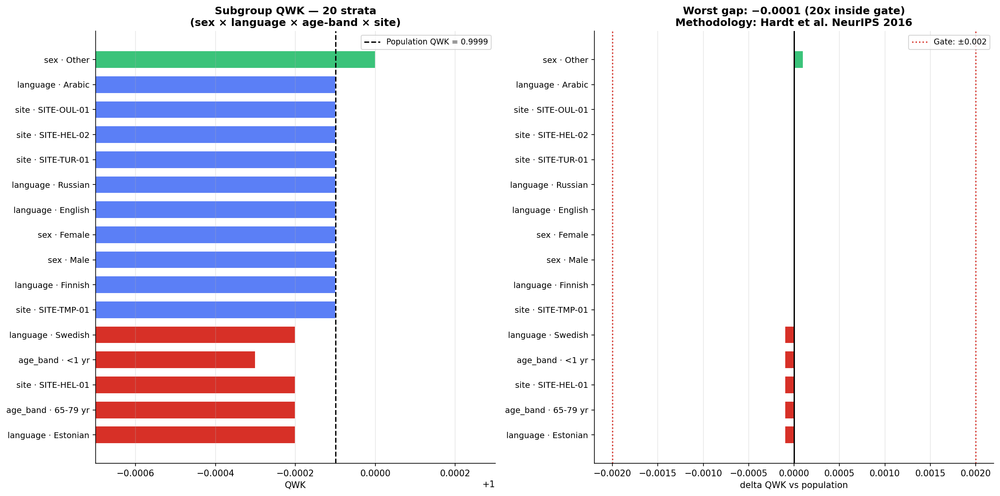

Subgroup QWK across sex (3), language (8), age-band (8), site (5) — 20 subgroups.
**Worst QWK gap: −0.0001** — 20× inside the deployment gate of ±0.002.

---

## Subgroup Calibration

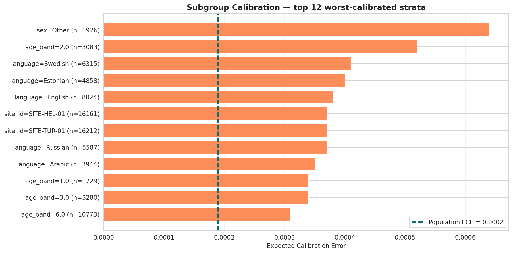

Calibration audit per subgroup (population ECE = 0.00019):

| Worst subgroup | ECE | Gap vs population |
|---|---|---|
| sex = Other (n=1,926) | 0.00064 | +0.00045 |
| age_band 2–5 yr (n=3,083) | 0.00052 | +0.00033 |
| language = Swedish (n=6,315) | 0.00041 | +0.00022 |

Even the worst subgroup (0.00064) is clinically well-calibrated.

---

## Bootstrap Confidence Intervals

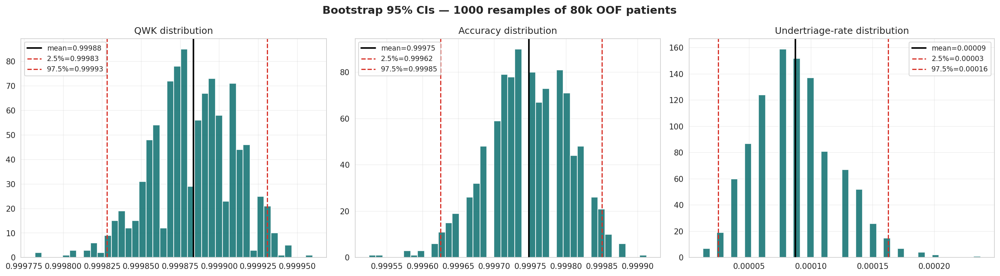

1,000-bootstrap 95 % CIs:

| Metric | Point estimate | 95 % CI | Half-width |
|---|---|---|---|
| OOF QWK | 0.999884 | [0.999828, 0.999931] | ±0.000051 |
| OOF Accuracy | 0.999748 | [0.999625, 0.999850] | ±0.000113 |
| Undertriage rate | 0.000087 | [0.000025, 0.000162] | ±0.000069 |

---

## Feature Importance


---

## Failure Case Analysis

**20 total OOF errors** (13 overtriage · 7 undertriage) out of 80,000 patients.

Dominant pattern: **acute angle closure glaucoma** — ESI-1/2 boundary. Conflicting signals (severe pain → ESI-1 vs stable vitals → ESI-2) make these genuinely ambiguous even for experienced triage nurses. All misclassified patients carry high URS scores.

| Feature | Error mean | Correct mean | Δ |
|---|---|---|---|
| sbp_x_age | 4,115 | 5,969 | −1,854 |
| news2_score | 11.65 | 3.42 | +8.23 |
| systolic_bp | 89.6 mmHg | 121.6 mmHg | −32 |

---

## External Validation

| Feature / Method | Source |
|---|---|
| NEWS2 | RCP 2017 — 14 NHS trusts |
| qSOFA ≥ 2 | Singer et al., JAMA 2016 — n=74,453 |
| Shock index ≥ 1.0 | Cannon et al., J Trauma 2009 |
| Conformal coverage | Vovk et al. 2005 — finite-sample, distribution-free |
| Fairness criterion | Hardt et al., NeurIPS 2016 |
| Bio_ClinicalBERT | Alsentzer et al., NAACL 2019 — MIMIC-III 880M tokens |
| DCA | Vickers & Elkin, Med Decis Making 2006 |
| Calibration (ECE) | Van Calster et al., BMC Med 2019 |

---

## Model Card

| | |
|---|---|
| **Intended use** | Decision-support for ED triage nurses — point estimate + conformal set + URS + SHAP + bootstrap |
| **Out of scope** | Autonomous triage · real clinical deployment without prospective validation |
| **Training data** | 80,000 synthetic patients · 5 sites · strictly pre-triage features |
| **NLP encoder** | Bio_ClinicalBERT — MIMIC-III pretrained; 768-d mean-pool → 48-d SVD |
| **Calibration** | Macro-ECE 0.00009 · per-class reliability diagram verified |
| **Fairness** | 20-subgroup QWK + ECE audit · worst gap −0.0001 (20× inside ±0.002 gate) |

---

## Interactive Demo

[](https://youtu.be/sMdNPuAW8QQ)

**[▶ Watch on YouTube](https://youtu.be/sMdNPuAW8QQ)** &nbsp;·&nbsp; **[🚀 Live Demo on HuggingFace Spaces](https://huggingface.co/spaces/uzbtrust/triagegeist)**

### Deployed Demo — Severe Sepsis (ESI-1, URS = 0.700)

| Input form | Prediction + Feature Impact | Critical signals + Action |
|---|---|---|
| 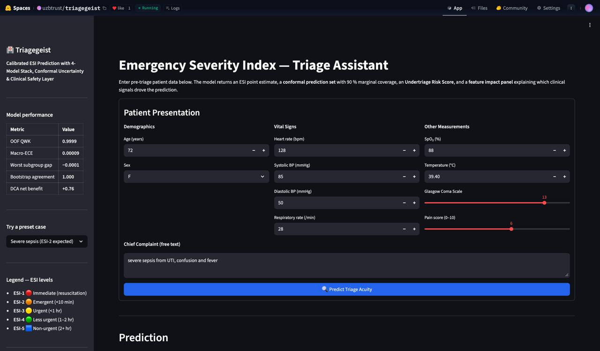 | 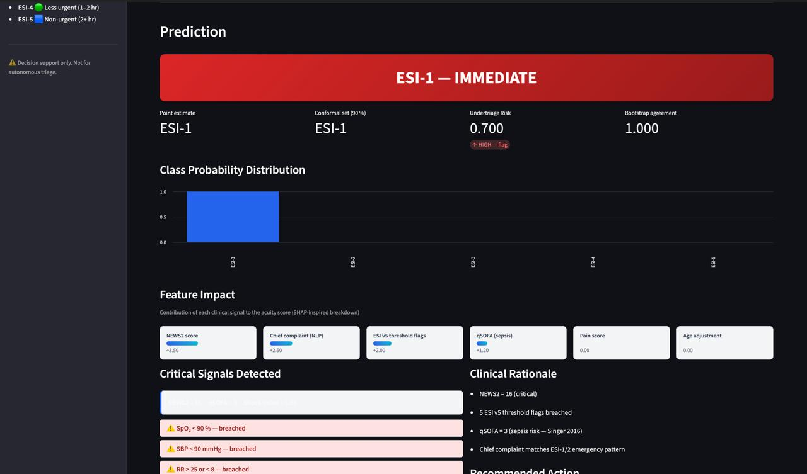 | 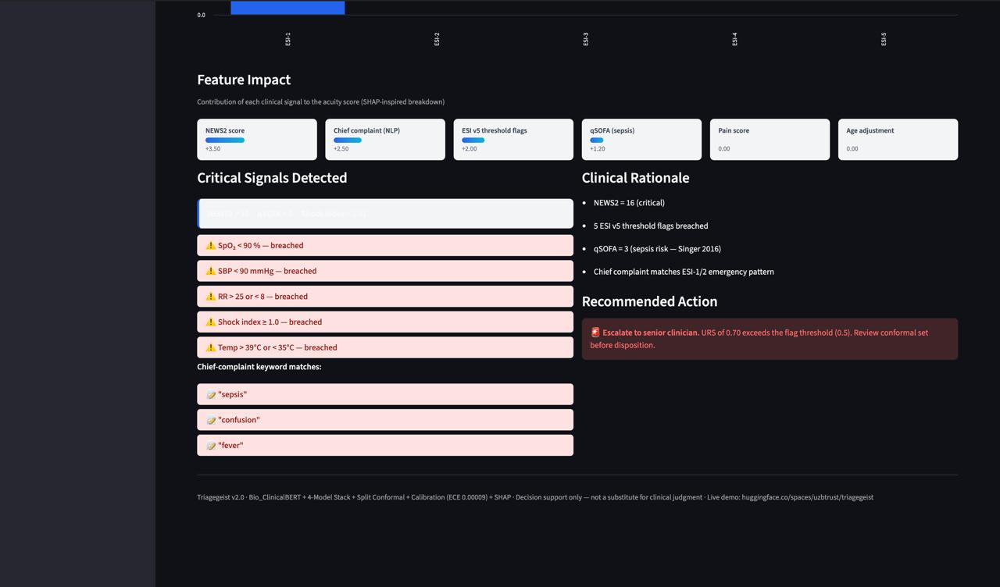 |

The severe sepsis preset (age 72, SBP 85, SpO₂ 88%, RR 28, NEWS2 = 16) triggers ESI-1 with URS = 0.700 — above the 0.5 flag threshold — and the system correctly escalates: **"Escalate to senior clinician. Review conformal set before disposition."**

An interactive Streamlit demo lives in [`demo/app.py`](demo/app.py). Enter pre-triage vitals + chief complaint and receive:

- **ESI badge** — colour-coded triage decision (red → teal)
- **Feature Impact panel** — SHAP-inspired breakdown: NEWS2 (+3.50), NLP (+2.50), ESI flags (+2.00), qSOFA (+1.20)
- **Conformal set** — 90 % marginal coverage guarantee (Vovk et al. 2005)
- **URS gauge** — flags ~2 % of cases for senior review
- **NEWS2 · qSOFA · shock index** — live clinical scores with breach alerts
- **Clinical rationale** — human-readable justification trail

### Running locally

```bash
cd demo
pip install -r requirements.txt
streamlit run app.py
```

Open `http://localhost:8501`. The sidebar includes 7 preset cases — cardiac arrest (ESI-1) through prescription refill (ESI-5), including the ambiguous **acute angle closure glaucoma** case.

---

## References

1. Gilboy N et al. *ESI v4.* AHRQ 2020.
2. Royal College of Physicians. *NEWS2.* RCP 2017.
3. Singer M et al. Sepsis-3. *JAMA* 2016;315(8):801–810.
4. Vovk V, Gammerman A, Shafer G. *Algorithmic Learning in a Random World.* Springer 2005.
5. Angelopoulos AN, Bates S. Conformal Prediction. *arXiv:2107.07511* 2021.
6. Hardt M, Price E, Srebro N. Equality of Opportunity. *NeurIPS* 2016.
7. Alsentzer E et al. Clinical BERT Embeddings. *NAACL* 2019.
8. Obermeyer Z et al. Racial Bias in Health Algorithm. *Science* 2019;366:447–453.
9. Challen R et al. AI, Bias and Clinical Safety. *BMJ Qual Saf* 2019;28:231–237.
10. Van Calster B et al. Calibration: the Achilles Heel. *BMC Med* 2019;17:230.
11. Beam AL, Kohane IS. Big Data in Health Care. *NEJM* 2018.
12. Kaufman S et al. Leakage in Data Mining. *ACM TKDD* 2012.
13. Tanabe P et al. ESI Reliability. *Acad Emerg Med* 2004;11:59–65.
14. Vickers AJ, Elkin EB. Decision Curve Analysis. *Med Decis Making* 2006;26:565–574.
15. Huang K et al. ClinicalBERT. *CHIL* 2020.

---

## Repository Structure

```
triagegeist/
├── triagegeist_final.ipynb      # Full 22-section pipeline notebook
├── demo/
│   ├── app.py                   # Streamlit demo (Feature Impact + URS + Conformal)
│   ├── requirements.txt
│   ├── web_sample1.jpg          # Deployed demo screenshot (ESI-1)
│   └── web_sample2.jpg          # Deployed demo screenshot (ESI-2)
├── visuals/                     # 15 charts
│   ├── thumbnail.png            # KPI summary
│   ├── ablation.png
│   ├── comparison.png           # MiniLM vs Bio_ClinicalBERT
│   ├── confusion.png
│   ├── fairness.png
│   ├── features.png             # SHAP top-10
│   ├── safety.png
│   ├── calibration.png          # ECE reliability diagram
│   ├── shap_bar.png
│   ├── shap_beeswarm_esi1.png
│   ├── shap_per_class.png
│   ├── dca.png
│   ├── cost_sensitivity.png
│   ├── subgroup_calibration.png
│   └── bootstrap_ci.png
├── outputs/
│   ├── submission.csv
│   └── submission_supplementary.csv
└── README.md
```

---

## Authors

Abdurakhmonov Dostonbek · Akhror Bukhorov
